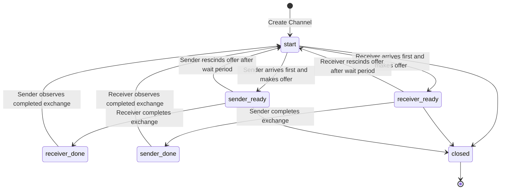

This directory contains a model for channels in Go for use in Perennial that has the following characteristics:
1. It is implemented as a generic struct in Go.
2. The struct stores a buffered ring queue that is used for buffered channels and 4 boolean flags that are used for unbuffered channel synchronization.
3. Each method in the struct other than Len/Cap/Close branches on whether the buffer has capacity 0 to determine whether the channel is Unbuffered or Buffered. Buffered channels use logic very similar to the concurrent blocking queue here: https://github.com/mit-pdos/gokv/blob/main/tutorial/queue/queue.go and unbuffered channels have a more subtle barrier-like implementation
4. There are TryReceive and TrySend functions that will be used by select statements and range for loops as described in the source code comments

The code here is translated using Goose's preexisting support for struct generics and Go code that uses channels is then translated directly into Gooselang code that references the output from translating channel.go. 

The tests in channel_test.go are the correctness based tests from https://go.dev/src/runtime/chanbarrier_test.go and https://go.dev/src/runtime/chan_test.go translated to this model from Go channels. These all passed except for TestSelfSelect. I documented the known edge cases in select statements that aren't quite modeled correctly.

The unbuffered channel behavior in this model is described in the diagram below:

